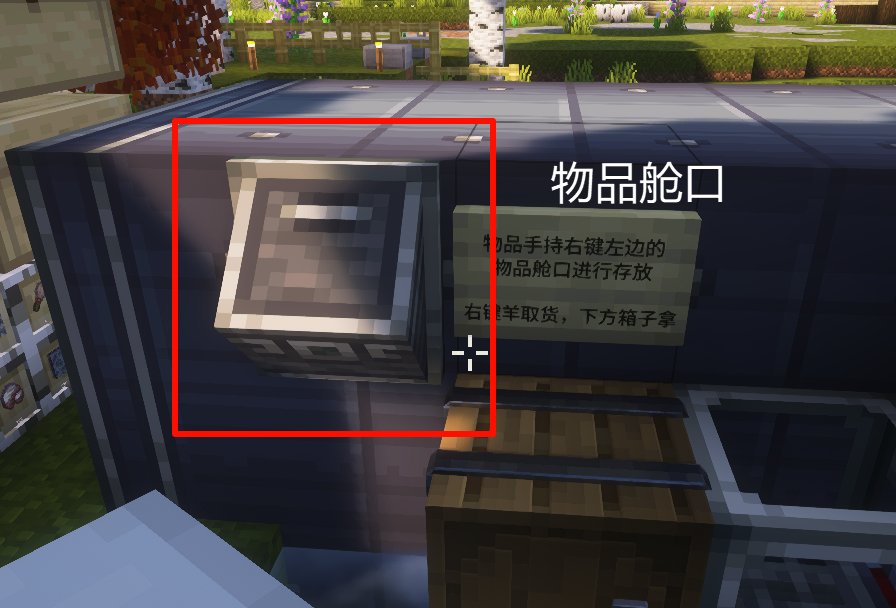
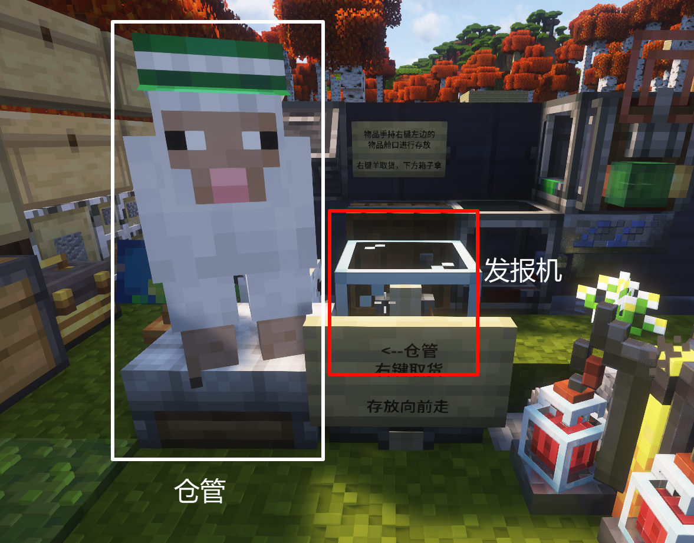
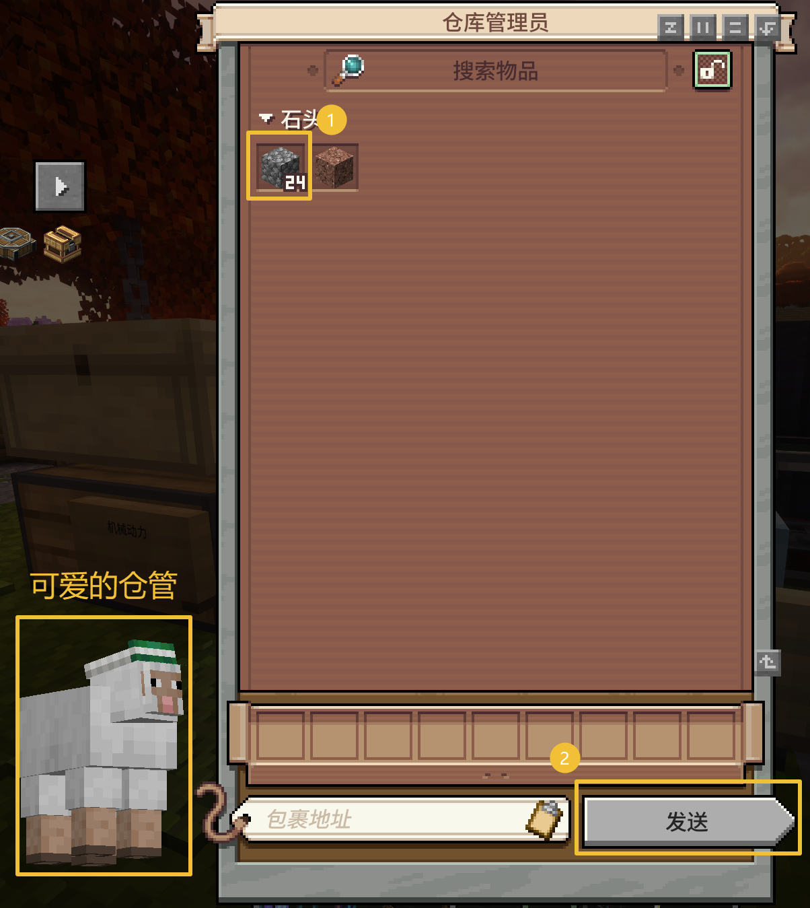
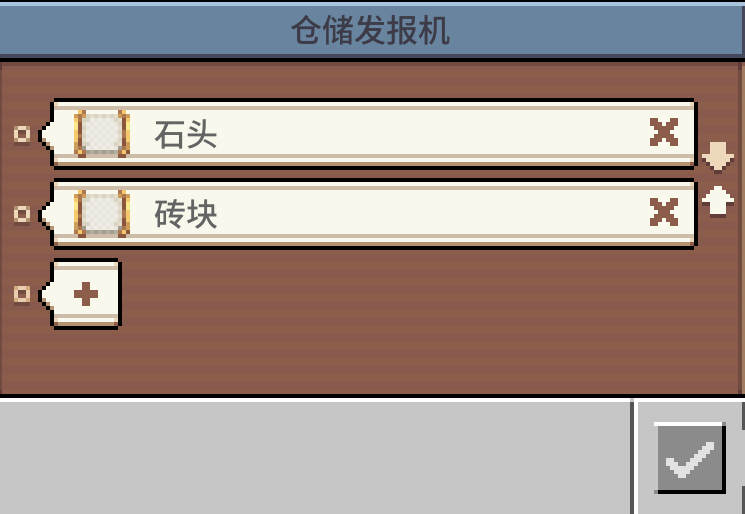
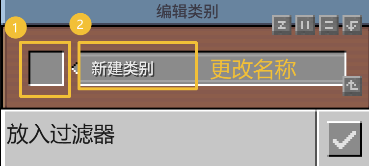

# 机械动力-物品网络使用指南
## 存放物品

- 手持物品右键`物品舱口`，将手持物品放入仓库
- 潜行+右键，放入除快捷栏的所有物品

## 取出物品

- 发报机旁边坐着的生物为仓管（🐑: *谁要动我，我让他取不出东西*）
- 右键仓管打开 GUI，选取希望提取的物品，点击**发送**

- 在仓库贴着的**木桶**提取物品

## 制定物品分类
### 指定物品

指定物品**用两种过滤器**（**列表过滤器**和**属性过滤器**）
- 列表过滤器适合不好定义分类、没有合适标签的物品，比如"下界之星"
- 属性过滤器适合有明确标签、标签足以甄别物品的（推荐）

> [!note] 物品标签
> 在 Minecraft 中，大多数物品都有自己的标签（旧称`矿物辞典`），如 A 模组添加的钢和 B 模组的钢能通用，就是因为配方识别了他们共有的标签`forge:steel`
>
> 使用物品标签来指定物品可以做到**举一反三**的妙用，如你只需要设置一个`forge:stone`，就可以同时指定安山岩、花岗岩、普通石头等等。

**使用过滤器时注意:**
- 黑、白名单的选择
- 是否匹配物品属性: *对于不同耐久的钻石剑，他们的名称和标签相同，但是属性不同*

### 设置分类
- 右键`仓储发报机`，打开 GUI

#### 添加新分类
- 点击加号，进入**新建类别界面**
- 左侧放入过滤器
- 点击中间的"新建类别"，改一个合适的名字
- 点击右下角的勾

#### 修改已有分类
如果想在已有分类进行修改（如`石头`类别中添加深板岩）

- 点击想修改分类右边的叉号，取出对应的过滤器
- 修改过滤器内容
- 点击加号放回，并为类别改名