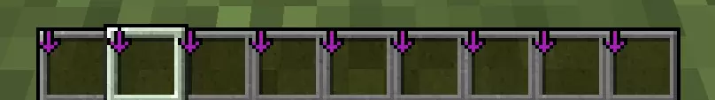

# 齿轮盛宴 魔改更新日志

## v1.2.0 基建防护与物流优化
### Creeper Fireworks Mod | 烟花苦力怕
> 作者: wendall911

用高度可配置的爆炸效果取代普通苦力怕爆炸，有效防止苦力怕破坏基地地形。
**模组特性：**
- **地形保护：** 默认禁用苦力怕爆炸破坏方块和掉落物，保护建筑安全
- **视觉反馈：** 爆炸后生成绚丽的烟花效果，既有警示作用又美观
- **高度可配置：** 可自定义烟花颜色（16进制）、高度（0-32）、闪烁效果
- **多种形状：** 支持小型球状、大型球状、星型、苦力怕状、喷发状等
- **灵活调整：** 可配置烟花生成概率（0-100%），或完全禁用烟花仅保留防护功能
- **模组兼容：** 支持苦力怕改革(Creeper Overhaul)模组联动

### Pipez | 高性能物流管道
为整合包添加轻量级、高性能的物流传输解决方案，补充Create以外的自动化选择。
**模组特性：**
- **极简设计：** 添加既简单又可配置的管道，最大限度地减少延迟
- **服务器友好：** 只有抽取管道有方块实体，管道不会加载不必要的区块
- **高效渲染：** 能高效地进行大量物品传输，性能优于传统管道系统
- **多类型支持：** 支持物品、流体、能量等多种管道类型
- **Mekanism联动：** 当装有通用机械模组时，增加气体管道支持

## v1.1.1 库存管理增强更新
### Inventory Profiles Next | 一键背包整理Next (IPN)
一键背包整理的延续模组，为玩家提供强大的库存管理能力。
**模组特性：**
- **智能整理：** 一键整理物品栏和容器，支持自定义排序规则
- **自动重装：** 工具即将损坏时自动替换新工具（Ctrl+左键点击槽位开关）
- **快速存取：** 一键将背包物品存入容器，或快速取出匹配物品
- **槽位锁定：** 锁定特定槽位，在整理时保持其内容不变
- **客户端专用：** 无需服务端安装，任何地方都能使用
- **丰富配置：** 按 R+C 打开配置菜单，高度可定制

**使用技巧：**
- 若要隐藏快捷栏紫色箭头：配置 → 自动重装 → 关闭"在启用的槽位上显示图标"
    
- 若要拾取物品优先进入快捷栏：配置 → 槽位锁定 → 开启"开启锁定槽位拾取物品"

## v1.1.0 视觉优化更新
### DistantHorizons | 遥远地平线
属于我们 MC 人自己的登山远眺模组，如果地形模组给予了壮丽辽阔的山脉，这个模组是真正赋予你极目远眺的能力。
**模组特性：**
- **超视距渲染：** 能够渲染极远距离的地形，让你站在山顶就能看到远方的山峦起伏
- **性能优化：** 通过LOD(Level of Detail)技术，在不牺牲过多性能的前提下实现远距离渲染
- **动态更新：** 随着你的探索，会动态生成和更新远方的地形数据
- **完美适配：** 与地形生成模组(TerrainBlender、TerraBlender等)完美兼容

**目前版本：**
*fabric-forge-2.3.2-b*

## 一切的开始 —— 整合包原版内容 v1.0.0
整合包围绕几个超大型模组构建的“科技+农业+探险”生态。

以下是根据模组数量和依赖关系整理出的核心**模组群（生态圈）**，你可以把它们看作整合包的“主菜”：

### 1. ⚙️ Create (机械动力) 生态圈 —— 【绝对核心】
这是你整合包中最大的阵营，拥有 **54个** 相关模组。几乎所有的科技、装饰、甚至部分农业都围绕它展开。
*   **核心模组:** `create-1.20.1-6.0.6.jar`
*   **附属内容极多:**
    *   **能源与科技扩展:** `create_new_age` (核能/电力), `createaddition` (电力支持), `createdieselgenerators` (柴油发电机), `create_oppenheimered` (核武)。
    *   **武器与载具:** `createbigcannons` (大炮), `create_jetpack` (喷气背包), `immersive_aircraft` + `man_of_many_planes` (通过Create联动的飞机)。
    *   **物流与存储:** `create_connected`, `functionalstorage` (有联动), `createrailwaysnavigator` (铁路导航)。
    *   **装饰:** `createdeco`, `design_decor`。
    *   **联动:** `kubejs-create` (脚本联动)。

### 2. 🍲 Farmer's Delight (农夫乐事) 生态圈 —— 【第二核心】
这是你的农业和生存基础，拥有 **29个** 相关模组。它极大地丰富了食物系统。
*   **核心模组:** `FarmersDelight-1.20.1-1.2.9.jar`
*   **扩展内容:**
    *   **菜系扩展:** `cuisinedelight` (中式/综合), `ends_delight` (末地), `oceanic_delight` (海洋), `culturaldelights` (世界文化), `festive_delicacies` (节日), `corn_delight` (玉米), `crabbersdelight` (螃蟹)。
    *   **功能扩展:** `farmersrespite` (茶文化), `brewinandchewin` (酿酒), `collectorsreap` (收集)。
    *   **重要联动桥梁:** `create_central_kitchen` (将农夫乐事与机械动力完美结合的关键模组)。

### 3. 🧬 Applied Energistics 2 (AE2 / 应用能源) 生态圈
负责后期的数字化仓储和自动化，虽然数量不如前两个多，但地位极高。
*   **核心模组:** `appliedenergistics2-forge-15.4.8.jar`
*   **扩展:**
    *   `AE2-Things`: 增加额外物品。
    *   `ae2wtlib`: 无线终端库，允许远程访问。
    *   `megacells`: 提供更大的存储元件。
    *   `ExtendedAE`: AE2的综合扩展。
    *   `ae2ct`: AE2与Create Tech的联动。

### 4. 🦖 Alex's Mods (Alex的生物/洞穴) 生态圈
主要的探险和世界观扩展来源。
*   **核心:** `alexsmobs` (增加大量现实与奇幻生物), `alexscaves` (深层洞穴维度)。
*   **扩展:** `alex_cave_addon`, `alexscavestrimmed` (轻量化)。
*   **联动:** `alexsdelight` (将Alex的生物掉落物做成食物)。

### 5. 🛠️ Tetra (模块化工具) 生态圈
取代或增强原版工具系统的打铁模组。
*   **核心:** `tetra-1.20.1-6.11.0.jar`
*   **扩展:** `art_of_forging` (高级锻造材料), `tetracelium`, `adtetra` (与Ad Astra联动)。

### 6. 🚀 Ad Astra (星际探险)
你的星辰大海目标。
*   **核心:** `ad_astra-forge-1.20.1-1.15.20.jar`
*   **扩展:** `Ad-Astra-Giselle-Addon` (极大优化了太空生存体验)。

### 7. 📚 知名系列模组 (Utility Suites)
除了上述玩法的核心，还有几组标准化的“基建”模组：
*   **FTB 系列 (11个):** `ftb-chunks` (圈地/地图), `ftb-quests` (任务系统), `ftb-ultimine` (连锁挖矿) 等。
*   **YUNG's 系列 (5个):** `YungsBetterMineshafts`, `YungsBetterStrongholds` 等，专门负责优化原版结构的生成，让遗迹更宏伟。
*   **Let's Do 系列 (3个):** `vinery` (葡萄酿酒), `bakery` (烘焙), `nethervinery`。风格非常小清新，适合建筑党。
*   **Sophisticated 系列 (3个):** `sophisticatedbackpacks` (背包), `sophisticatedcore`。

### 总结与建议
如果你是整合包制作者或刚开始玩：
1.  **重点关注 `Create` 和 `Farmer's Delight`**：这两个模组在你的包里互相交织（通过 `Create Central Kitchen` 和各种 `Slice & Dice` 类的联动），是前期到中期的主要玩法。
2.  **科技路线**：从 `Create` 起步 -> `Create New Age` (核能/电) -> 过渡到 `Ad Astra` (太空) 和 `AE2` (数字存储)。
3.  **探险路线**：`Alex's Mobs` 贯穿全程 -> `Alex's Caves` 是后期的地下探险核心。